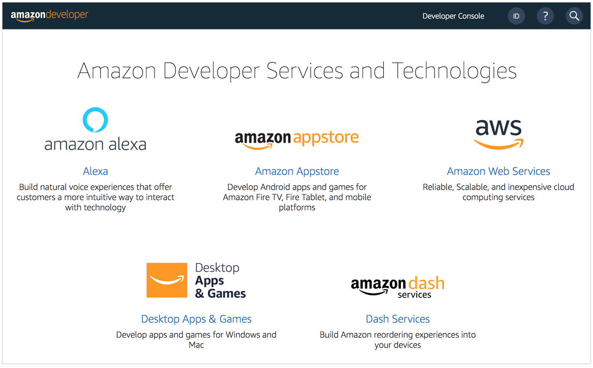
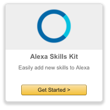
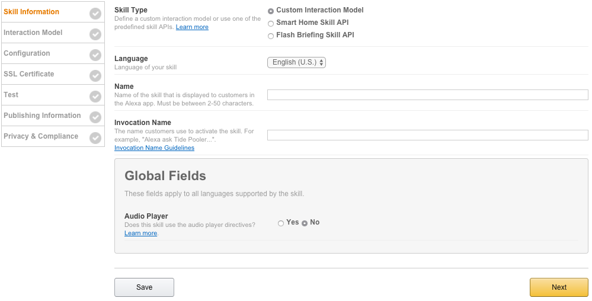
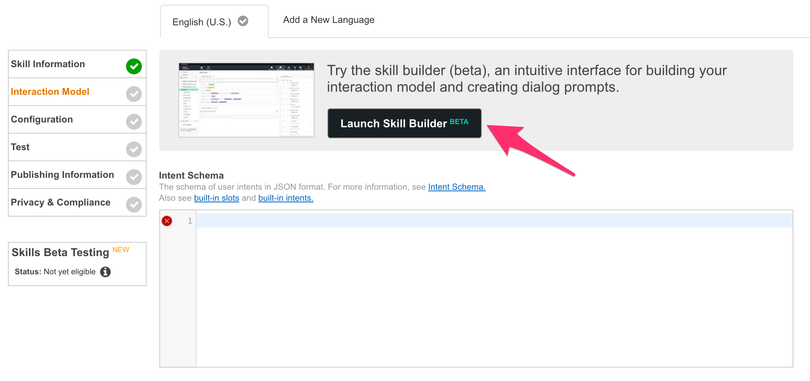
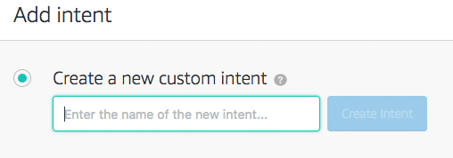
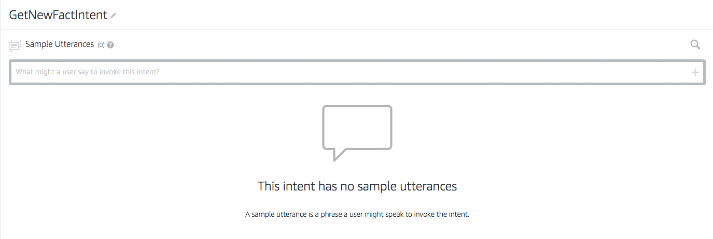
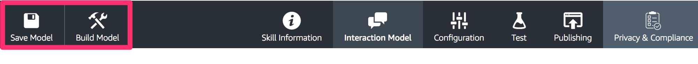
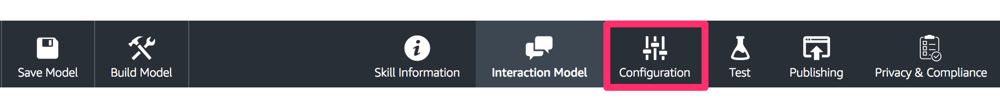

# Creating Your First Skill

## Part 1: Setting Up Your Alexa Skill in the Developer Portal
There are two parts to an Alexa skill. The first part is the [Voice User Interface](https://developer.amazon.com/public/solutions/alexa/alexa-skills-kit/docs/defining-the-voice-interface) (VUI). This is where we define how we will handle a user's voice input, and which code should be executed when specific commands are uttered. The second part is the actual code logic for our skill, and we will handle that on [step 2](./workshop_02.md) of this step-by-step guide.

1. **Go to the [Amazon Developer Portal](http://developer.amazon.com). In the top-right corner of the screen, click the "Sign In" button.**
(If you don't already have an account, you will be able to create a new one for free.)

1. **Once you have signed in, click the Alexa button at the top of the screen.**

1. **On the Alexa page, choose the "Get Started" button for the Alexa Skills Kit.**  

1. **Select "Add A New Skill."** This will get you to the first page of your new Alexa skill.  

1. **Fill out the Skill Information screen.** Make sure to review the tips we provide below the screenshot.  
  * **Skill Type.** For this skill, we are creating a skill using the Custom Interaction Model. This is the default choice.
  * **Language.** Choose the first language you want to support. You can add additional languages in the future, but we need to start with one. (This guide is using U.S. English to start.)
  * **Name.** This is the name that will be shown in the Alexa Skills Store, and the name your users will refer to.
  * **Invocation Name.** This is the name that your users will need to say to start your skill. We have provided some common issues developers encounter in the list below, but you should also review the entire [Invocation Name Requirements](https://developer.amazon.com/public/solutions/alexa/alexa-skills-kit/docs/choosing-the-invocation-name-for-an-alexa-skill).
    * The skill invocation name must not infringe upon the intellectual property rights of an entity or person.  **Wrong:** `korean air`, `septa check`
    * Invocation names should be more than one word (unless it is a brand or intellectual property), and must not be a name or place  **Wrong:** `horoscope`, `trivia`, `guide`, `new york`
    * Two word invocation names are not allowed when one of the words is a definite article, indefinite article, or a preposition  **Wrong:** `any poet`, `the bookie`, `the fool`
    * The invocation name must not contain any of the Alexa skill launch phrases and connecting words. Launch phrase examples include "launch," "ask," "tell," "load," and "begin." Connecting word examples include "to," "from," "by," "if," "and," "whether."  **Wrong:** `trivia game for star wars`, `better with bacon`
    * The invocation name must not contain the wake words "Alexa," "Amazon," "Echo," or the words "skill" or "app."  **Wrong:** `hackster initial skill`, `word skills`
    * The invocation name must be written in each language you choose to support. For example, the German version of your skill must have an invocation name written in German, while the English (US) version must have an invocation name written in English.  **Wrong:** `kitchen stories` (German skill)
  * **Audio Player.** For this Fact skill, we won't be using any audio files, so you can select No for this option. If you would like to learn more about adding audio to your skills, please check out our [Audio Player Guide](https://github.com/alexa/skill-sample-nodejs-audio-player).
6. **Click the Next button to move to the Interaction Model.** 

7. Click on the Launch Skill Builder button. This will launch the new Skill Builder Dashboard. 

8. Click on the "Add+" button near Intents on the top left corner of the dashboard. 

9. In the textbox provided, enter the new intent name: GetNewFactIntent., and click the Create Intent button. 

10. Add 10-15 sample utterances for your intent. These are the things a user would say to make this intent happen. Here are a few examples:
  * Give me a fact
  * Tell me a fact
  * Tell me something
  * Tell me a space fact
  
11. Click on the Save Model button, and then click on the Build Model button.   
12. If your interaction model builds successfully, click on Configuration button to move on to Configuration.  

### Next Steps
In [part two](./workshop_02.md) of this guide, we will be creating our Lambda function in the AWS developer console, but keep this browser tab open, because we will be returning here on [part 3](./workshop_03.md): Connect VUI to Code. 

### Troubleshooting
If you get an error from your interaction model, check through this list:
* Did you copy & paste the provided code into the appropriate boxes?
* Did you accidentally add any characters to the Interaction Model or Sample Utterances?