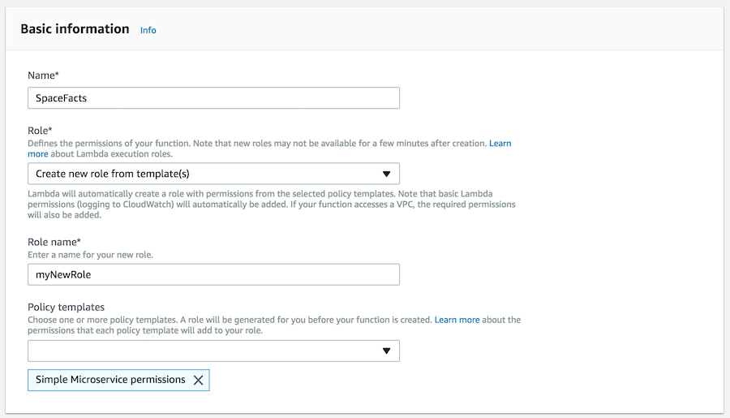
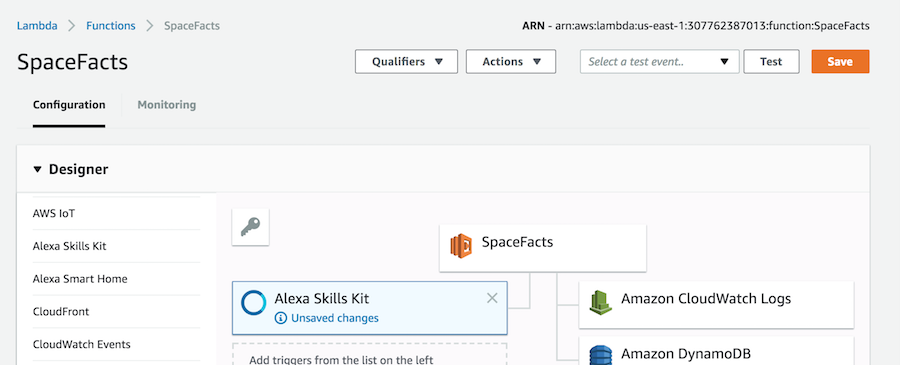
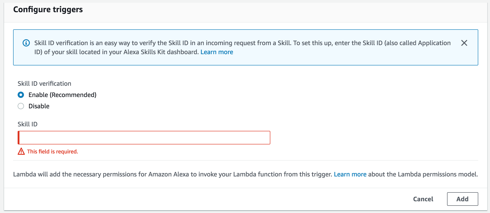
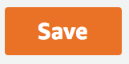
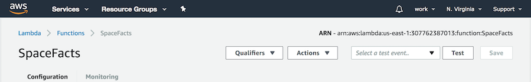

# Creating Your First Skill

## Step 2: Setting Up A Lambda Function Using Amazon Web Services

In the first step of this guide, we built the Voice User Interface (VUI) for our Alexa skill. On this page, we will be creating an AWS Lambda function using [Amazon Web Services](https://aws.amazon.com). You can [read more about what a Lambda function is](http://aws.amazon.com/lambda), but for the purposes of this workshop, what you need to know is that AWS Lambda is where our code lives. When a user asks Alexa to use our skill, it is our AWS Lambda function that interprets the appropriate interaction, and provides the conversation back to the user.

1. Go to http://aws.amazon.com and sign in to the console. If you don't already have an account, you will need to create one. If you don't have an AWS account, check out this [quick walkthrough](https://github.com/alexa/alexa-cookbook/tree/master/aws/set-up-aws.md) for setting it up.  

1. Click "Services" at the top of the screen, and type "Lambda" in the search box. You can also find Lambda in the list of services. It is in the "Compute" section.  

1. Check your AWS region. AWS Lambda only works with the Alexa Skills Kit in two regions: US East (N. Virginia) and EU (Ireland). Make sure you choose the region closest to your customers.  

1. Click the "Create a function" button. It should be near the top of your screen. (If you don't see this button, it is because you haven't created a Lambda function before. Click the blue "Get Started" button near the center of your screen.)  

1. Choose the blueprint named "alexa-skill-kit-sdk-factskill". We have created a blueprint as a shortcut to getting everything set up for your skill. You can search for a blueprint using the provided search box. This blueprint adds the alexa-sdk to your Lambda function so that you don't have to upload it yourself.  

1. Configure your function. This screen is where we will enter the important parts of our Lambda function and setup the Lambda function role. Name your function "SpaceFacts", select "Create a new role from template(s)" from the Role dropdown menu, and enter "myNewRole" as the name for this new role. Select "Simple Microservice permissions" from the Policy templates dropdown menu. Scroll down to end of page and click the "create function" button. 

1. Configure your trigger. Click in the dashed box, and select Alexa Skills Kit from the list. If you don't see Alexa Skills Kit in the list, jump back to step #3 on this page.  

1. Associate your Alexa Skill with your Lambda function. Scroll down to enter the Skill ID (also called Application ID) of your skill and click the "Add" button. The Skill ID is located in your Alexa Skills Kit dashboard.  

1. Save your Lambda function. Scroll up to top of page and click "Save" button.  

1. Copy your Lambda function's ARN value. The ARN value appears in the top right corner. Copy this value for use in the next section of the guide.  

## Next Steps
You're now ready to [connect the VUI to the code](./workshop_03.md).
