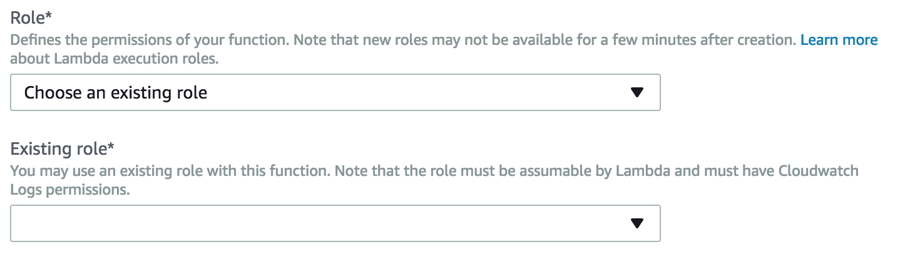

# Creating Your First Skill

## Step 2: Setting Up A Lambda Function Using Amazon Web Services

In the first step of this guide, we built the Voice User Interface (VUI) for our Alexa skill. On this page, we will be creating an AWS Lambda function using [Amazon Web Services](https://aws.amazon.com). You can [read more about what a Lambda function is](http://aws.amazon.com/lambda), but for the purposes of this guide, what you need to know is that AWS Lambda is where our code lives. When a user asks Alexa to use our skill, it is our AWS Lambda function that interprets the appropriate interaction, and provides the conversation back to the user.

1. Go to http://aws.amazon.com and sign in to the console. If you don't already have an account, you will need to create one. If you don't have an AWS account, check out this [quick walkthrough](https://github.com/alexa/alexa-cookbook/tree/master/aws/set-up-aws.md) for setting it up.  

1. Click "Services" at the top of the screen, and type "Lambda" in the search box. You can also find Lambda in the list of services. It is in the "Compute" section.  

1. Check your AWS region. AWS Lambda only works with the Alexa Skills Kit in two regions: US East (N. Virginia) and EU (Ireland). Make sure you choose the region closest to your customers.  

1. Click the "Create a Lambda function" button. It should be near the top of your screen. (If you don't see this button, it is because you haven't created a Lambda function before. Click the blue "Get Started" button near the center of your screen.)  

1. Choose the blueprint named "alexa-skill-kit-sdk-factskill". We have created a blueprint as a shortcut to getting everything set up for your skill. You can search for a blueprint using the provided search box. This blueprint adds the alexa-sdk to your Lambda function so that you don't have to upload it yourself.  

1. Configure your trigger. Click in the dashed box, and select Alexa Skills Kit from the list. If you don't see Alexa Skills Kit in the list, jump back to step #3 on this page.  

  Once you have selected Alexa Skills Kit, click the Next button.

1. Configure your function. This screen is where we will enter the important parts of our Lambda function. These values will only ever be visible to you, but make sure that you name your function something meaningful. "SpaceFacts" is sufficient if you don't have another idea for a name.  

1. Copy and paste the [provided code](https://github.com/alexa/skill-sample-nodejs-fact/blob/en-US/lambda/custom/index.js) into the Lambda function code box. We have provided the code for this skill on [GitHub](https://github.com/alexa/skill-sample-nodejs-fact/blob/en-US/lambda/custom/index.js). Delete the contents of the code box, and paste the contents of the new code.

1. Set up your Lambda function role. If you haven't done this before, we have a detailed walkthrough for [setting up your first role for Lambda](https://github.com/alexa/alexa-cookbook/tree/master/aws/lambda-role.md). If you have done this before, set your Existing role value to "lambda_basic_execution."  

1. For this guide, you can skip all of the Advanced settings. Click the Next button to move to the Review screen.  

1. The Review screen is a summary of your choices. Click Create Function in the bottom left corner. You will need to scroll down to find Create Function.  

1. After you create the function, the ARN value appears in the top right corner. Copy this value for use in the next section of the guide.  

## Next Steps
You're now ready to [connect the VUI to the code](./workshop_03.md).