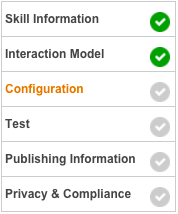
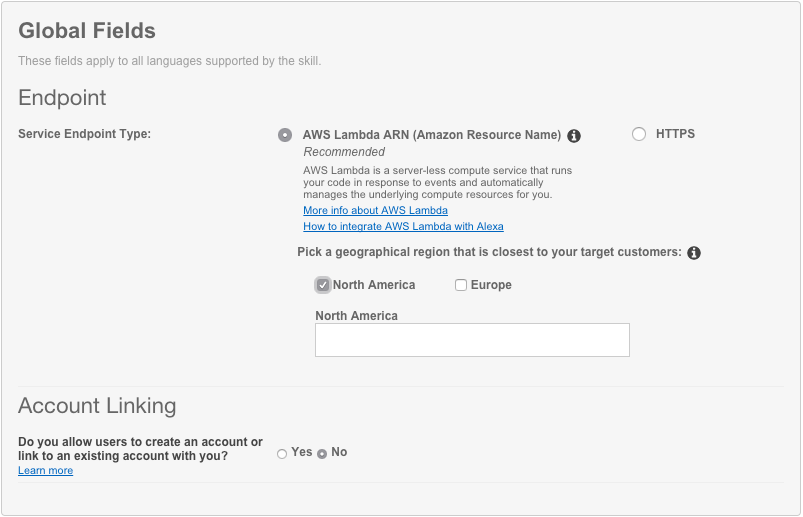
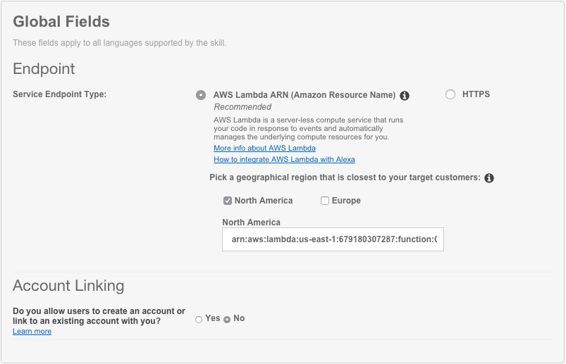

# Creating Your First Skill

## Step 3: Connecting Your Voice User Interface To Your Lambda Function
In step one of this guide, we created a voice user interface for the intents and utterances we expect from our users. In step 2, we created a Lambda function that contains all of our logic for the skill. On this page, we need to connect those two pieces together.

1. Go back to the [Amazon Developer Portal](https://developer.amazon.com/edw/home.html#/skills/list) and select your skill from the list. You may still have a browser tab open if you started at the beginning of this tutorial.

1. Open the "Configuration" tab on the left side.  

1. Select the "AWS Lambda ARN" option for your endpoint. You have the ability to host your code anywhere that you would like, but for the purposes of simplicity and frugality, we are using AWS Lambda. ([Read more about Hosting Your Own Custom Skill Web Service](https://developer.amazon.com/public/solutions/alexa/alexa-skills-kit/docs/developing-an-alexa-skill-as-a-web-service)) With the AWS Free Tier, you get 1,000,000 free requests per month, up to 3.2 million seconds of compute time per month. Learn more at https://aws.amazon.com/free/. In addition, Amazon now offers [AWS Promotional Credits](https://developer.amazon.com/alexa-skills-kit/alexa-aws-credits) for developers who have live Alexa skills that incur costs on AWS related to those skills.  

1. Select "North America" or "Europe" as your geographical region. IMPORTANT: Make sure you select the same region that you created your Lambda in. Remember, Alexa skills using AWS Lambda can only run in N. Virginia (North America) and Ireland (Europe).  

1. Paste your Lambda's ARN (Amazon Resource Name) into the textbox provided. It should look similar to the screenshot above.

1. Leave "Account Linking" set to "No." For this skill, we won't be using Account Linking, but you can learn more about [Linking an Alexa User with a User in Your System](https://developer.amazon.com/public/solutions/alexa/alexa-skills-kit/docs/linking-an-alexa-user-with-a-user-in-your-system).